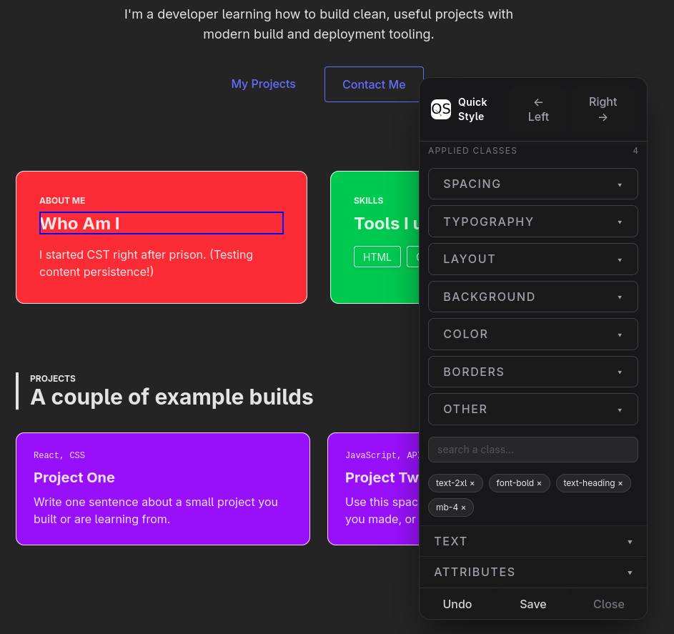

# QuickStyle

First Place Winner of [BCIT Hack The Break 2026](https://hackthebreak2026.devpost.com/) Hackathon [\[devpost\]](https://devpost.com/software/quickstyle)

QuickStyle is a tool to help style your react project quickly and easily.

Through an element selector, you're able to edit your UI directly on the page and see it update in real time.

Once you're happy with those changes, click save and QuickStyle will update your source code to match!

For projects using Vite+React+Tailwind



Available at [npmjs.com](https://www.npmjs.com/package/quick-style-hackathon)

QuickStyle will take your tailwind styling to the next level!

## Installation

```
npm install quick-style-hackathon
```

## Setup

1. Setup vite.config.js:

```
import { defineConfig } from 'vite';
import react from '@vitejs/plugin-react';
import tailwindcss from '@tailwindcss/vite';
import { quickStyle } from 'quick-style-hackathon';

export default defineConfig({
  plugins: [
    react({
      babel: {
        plugins: ["quick-style-hackathon/babel-plugin"],
      },
    }),
    tailwindcss(),
    quickStyle(),
  ],
});
```

2. Add QuickStyle component to your file

```
import { QuickStyle } from 'quick-style-hackathon';
import 'quick-style-hackathon/style.css';

function App() {
  return (
    <>
      <QuickStyle />
      {/* Your App Code */}
    </>
  );
}
```
